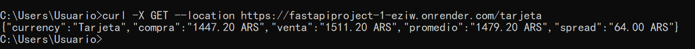

# Monedas API

## Descripción General

Monedas API es una aplicación robusta desarrollada con FastAPI, diseñada para proporcionar tasas de cambio de divisas en tiempo real mediante scraping de sitios web financieros. La API se enfoca principalmente en varias tasas de cambio en Argentina, incluyendo USD (blue, oficial, MEP, CCL), Euro, Real Brasileño, Peso Chileno, Peso Uruguayo, y más. También ofrece una función de conversión para convertir montos entre las monedas soportadas.


> [!NOTE]
> Inspirado por la [Dolar API](https://github.com/enzonotario/esjs-dolar-api) de Enzo Notario.

## Funcionalidades

- **Tasas de Cambio en Tiempo Real**: Obtiene las últimas tasas de cambio para múltiples monedas, específicamente adaptadas para el mercado argentino.
- **Conversión de Monedas**: Permite la conversión de montos de una moneda a otra utilizando las últimas tasas de cambio.
- **Soporte Integral de Monedas**: Soporta una amplia gama de monedas, incluyendo USD (varias tasas), Euro, BRL, CLP, UYU, y más.
- **Manejo Robusto de Errores**: Garantiza la obtención y procesamiento fiable de datos con mecanismos de manejo de errores integrales.

## Endpoints

### Tasas de Cambio de Divisas

Obtén las últimas tasas de cambio para varias monedas:

#### Tasas de USD
- `/blue` - Tasa del Dólar Blue
- `/oficial` - Tasa del Dólar Oficial
- `/mep` - Tasa del Dólar MEP
- `/ccl` - Tasa del Dólar CCL
- `/mayorista` - Tasa del Dólar Mayorista
- `/cripto` - Tasa del Dólar Cripto
- `/tarjeta` - Tasa del Dólar Tarjeta

#### Otras Monedas
- `/usd` - Tasa del Dólar Estadounidense
- `/euro` - Tasa del Euro
- `/real` - Tasa del Real Brasileño
- `/clp` - Tasa del Peso Chileno
- `/uru` - Tasa del Peso Uruguayo
- `/oro` - Tasa del Oro

Cada endpoint proporciona la tasa de cambio actual, incluyendo precios de compra y venta, tasa promedio y spread.

### Documentación

- [Documentación de la API](https://fastapiproject-1-eziw.onrender.com/docs) (¡pruébalo en el navegador!)

> [!TIP]
> Prueba la [API Interactiva!](https://fastapiproject-1-eziw.onrender.com/redoc)

## Ejemplo de Uso

```bash
curl -X GET --location https://fastapiproject-1-eziw.onrender.com/USD/EUR/100
```

```json
{
  "source": "USD",
  "target": "EUR",
  "amount": 100,
  "converted": 85.5
}
```

```bash
curl -X GET --location https://fastapiproject-1-eziw.onrender.com/blue
```

```json
{
  "currency": "blue",
  "compra": "1425.00 ARS",
  "venta": "1445.00 ARS",
  "promedio": "1435.00 ARS",
  "spread": "20.00 ARS"
}
```

```bash 
curl -X GET --location https://fastapiproject-1-eziw.onrender.com/euro
```

```json
{
  "currency": "Euro",
  "compra": "1.00 ARS",
  "venta": "1.01 ARS",
  "promedio": "1.00 ARS",
  "spread": "0.01 ARS"
}
```



## Aplicaciones que consumen esta API

- [Mercado Libre Price Chart](https://github.com/pyoneerC/mercado-libre-price-chart) - Una aplicación web que muestra un histograma de precios del producto seleccionado en Mercado Libre Argentina. (Hecha por mí)

### Contributing

¡Las contribuciones son bienvenidas! No dudes en enviar un pull request o abrir un issue si tienes alguna sugerencia o comentario.

### License

Este proyecto está licenciado bajo la Unlicense. Es parte del dominio público y puedes usarlo como desees.

> [!IMPORTANT]
> Esta API está alojada en el nivel gratuito de Render, que puede tener limitaciones de uso. Por favor, úsala de manera responsable y considera alojar tu propia instancia si es necesario.