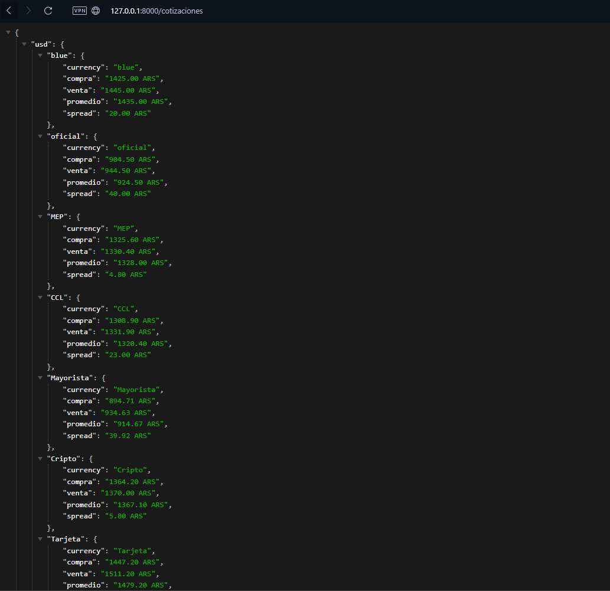

# Monedas API

## Overview

Monedas API is a robust FastAPI application designed to provide real-time currency exchange rates by scraping financial websites. The API primarily focuses on various exchange rates in Argentina, including USD (blue, official, MEP, CCL), Euro, Brazilian Real, Chilean Peso, Uruguayan Peso, and more. It also offers a conversion feature to convert amounts between supported currencies.



> ![NOTE]
> Inspired by Enzo Notario's Dolar API.

## Features

- **Real-time Currency Rates**: Fetches the latest exchange rates for multiple currencies, specifically tailored for the Argentine market.
- **Currency Conversion**: Allows conversion of amounts from one currency to another using the latest exchange rates.
- **Comprehensive Currency Support**: Supports a wide range of currencies including USD (various rates), Euro, BRL, CLP, UYU, and more.
- **Robust Error Handling**: Ensures reliable data fetching and processing with comprehensive error handling mechanisms.

## Endpoints

### Currency Exchange Rates

Retrieve the latest exchange rates for various currencies:

#### USD Rates
- `/blue` - Blue Dollar rate
- `/oficial` - Official Dollar rate
- `/mep` - MEP Dollar rate
- `/ccl` - CCL Dollar rate
- `/mayorista` - Wholesale Dollar rate
- `/cripto` - Crypto Dollar rate
- `/tarjeta` - Credit Card Dollar rate

#### Other Currencies
- `/usd` - US Dollar rate
- `/euro` - Euro rate
- `/real` - Brazilian Real rate
- `/clp` - Chilean Peso rate
- `/uru` - Uruguayan Peso rate
- `/oro` - Gold rate

Each endpoint provides the current exchange rate, including buy and sell prices, average rate, and spread.

## Example Usage

```bash
curl https://fastapiproject-1-eziw.onrender.com/USD/EUR/100
```

```json
{
  "source": "USD",
  "target": "EUR",
  "amount": 100,
  "converted": 85.5
}
```

```bash
curl https://fastapiproject-1-eziw.onrender.com/blue
```

```json
{
  "currency": "blue",
  "compra": "1425.00 ARS",
  "venta": "1445.00 ARS",
  "promedio": "1435.00 ARS",
  "spread": "20.00 ARS"
}
```

```bash 
curl https://fastapiproject-1-eziw.onrender.com/euro
```

```json
{
  "currency": "Euro",
  "compra": "1.00 ARS",
  "venta": "1.01 ARS",
  "promedio": "1.00 ARS",
  "spread": "0.01 ARS"
}
```

### Documentation

- [API Documentation](https://fastapiproject-1-eziw.onrender.com/docs)
- **Interactive API**: [Monedas API Docs](https://fastapiproject-1-eziw.onrender.com/redoc)

### Contributing

Contributions are welcome! Feel free to submit a pull request or open an issue if you have any suggestions or feedback.

### License

This project is licensed under the Unlicense. This is part of the public domain and free to use as you see fit.
```