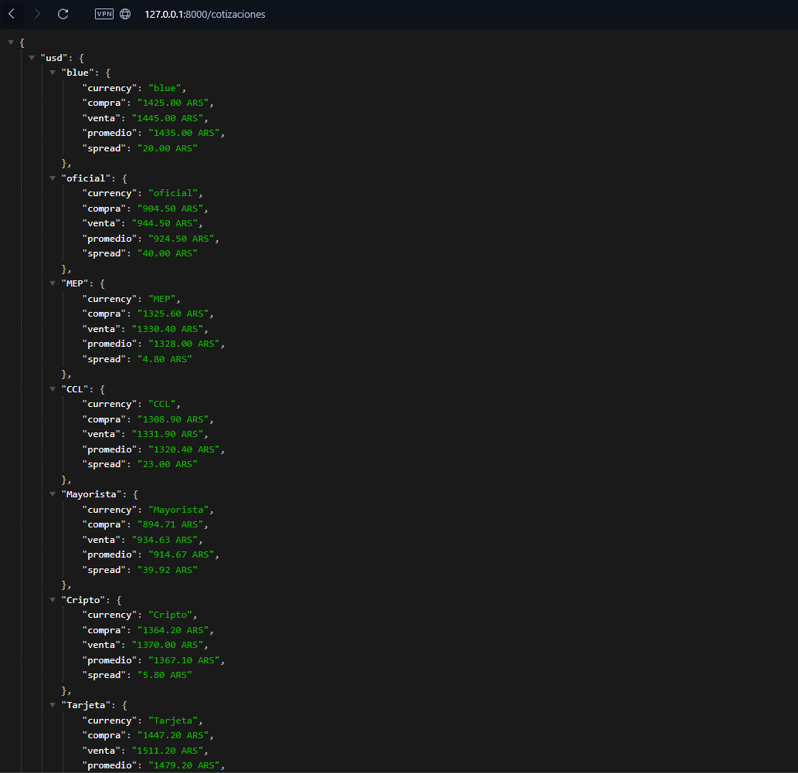
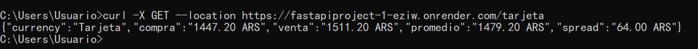
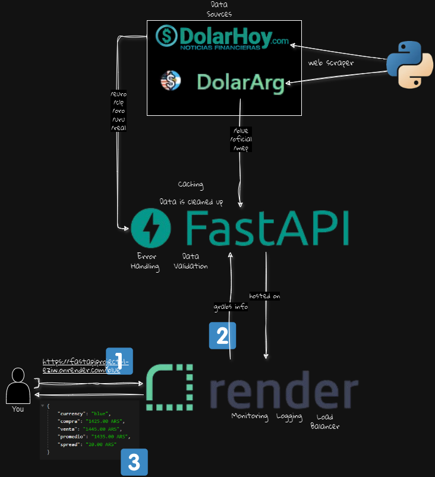

# ArgentoFX


## Overview

**ArgentoFX** is a robust application built with **FastAPI**, designed to deliver real-time exchange rates through web scraping from financial websites. The API primarily focuses on various exchange rates relevant to Argentina, including USD (blue, official, MEP, CCL), Euro, Brazilian Real, Chilean Peso, Uruguayan Peso, and more. It also features a currency conversion tool for supported currencies.




> [!NOTE]  
> See it on [Docker Hub](https://hub.docker.com/repository/docker/maxcomperatore/argentofx/general).

> [!IMPORTANT]  
> This API is hosted on Render’s free tier, which may come with usage limitations. Please use it responsibly, and consider deploying your own instance if needed.

> [!CAUTION]  
> **Important Notice (April 11, 2025):** Due to recent changes in Argentina's monetary policy, the currency control system ("cepo") has been officially lifted. As a result, alternative exchange rates such as blue, MEP, and CCL no longer exist.
>
> This means there is now only a single official exchange rate, significantly reducing the need for this API. Therefore, **ArgentoFX is now deprecated** and may stop functioning at any time as data sources phase out.
>
> While I will no longer maintain or update this project, I’m leaving it available for educational purposes. Feel free to fork it and adapt it for your own use.

## Features

- **Real-Time Exchange Rates**: Fetches the latest exchange rates for multiple currencies, with a special focus on the Argentine market.
- **Currency Conversion**: Allows conversion between currencies using the latest available rates.
- **Comprehensive Currency Support**: Includes USD (with multiple rate types), Euro, BRL, CLP, UYU, Gold, and more.
- **Robust Error Handling**: Ensures reliable data fetching and processing with built-in error management.

## Endpoints

### USD Exchange Rate Types
- `/blue` – Blue Dollar rate
- `/oficial` – Official Dollar rate
- `/mep` – MEP Dollar rate
- `/ccl` – CCL Dollar rate
- `/mayorista` – Wholesale Dollar rate
- `/cripto` – Crypto Dollar rate
- `/tarjeta` – Credit Card Dollar rate

### Other Currencies
- `/usd` – United States Dollar
- `/euro` – Euro
- `/real` – Brazilian Real
- `/clp` – Chilean Peso
- `/uru` – Uruguayan Peso
- `/oro` – Gold rate

Each endpoint returns the current exchange rate, including buy and sell prices, average rate, and the spread (difference between buy and sell).

## Documentation

- [API Docs (Swagger)](https://fastapiproject-1-eziw.onrender.com/docs) – Try it directly in your browser!
- [Interactive API Explorer (ReDoc)](https://fastapiproject-1-eziw.onrender.com/redoc)

## Example Usage

```bash
curl -X GET --location https://fastapiproject-1-eziw.onrender.com/USD/EUR/100
```

```json
{
  "source": "USD",
  "target": "EUR",
  "amount": 100,
  "converted": 85.5
}
```

```bash
curl -X GET --location https://fastapiproject-1-eziw.onrender.com/blue
```

```json
{
  "currency": "blue",
  "compra": "1425.00 ARS",
  "venta": "1445.00 ARS",
  "promedio": "1435.00 ARS",
  "spread": "20.00 ARS"
}
```

```bash 
curl -X GET --location https://fastapiproject-1-eziw.onrender.com/euro
```

```json
{
  "currency": "Euro",
  "compra": "1.00 ARS",
  "venta": "1.01 ARS",
  "promedio": "1.00 ARS",
  "spread": "0.01 ARS"
}
```



## Architecture Diagram



## Applications Using This API

- [Mercado Libre Price Chart](https://github.com/pyoneerC/mercado-libre-price-chart) – A web application that displays a price histogram for selected products on Mercado Libre Argentina. (Built by me)

### Contributing

Contributions are welcome! Feel free to submit a pull request or open an issue if you have suggestions or feedback.

### License

This project is licensed under the **Unlicense**. It is public domain software – you are free to use it however you wish.